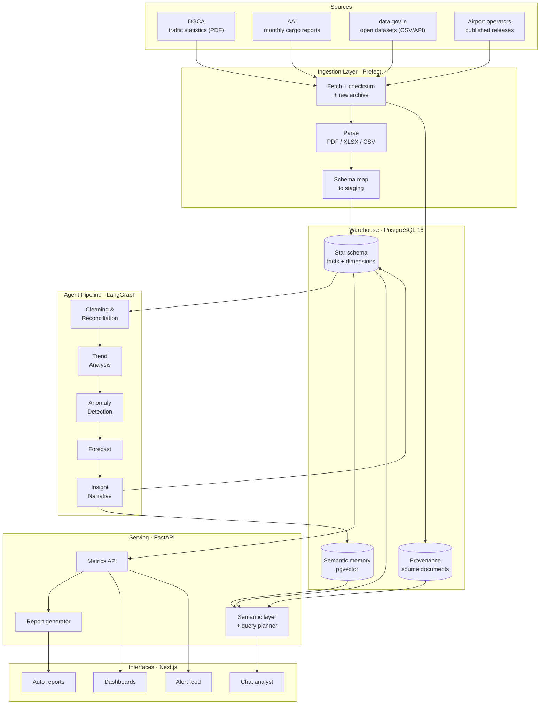
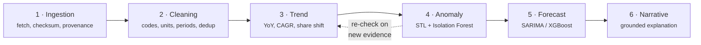
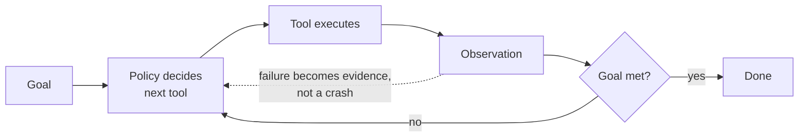
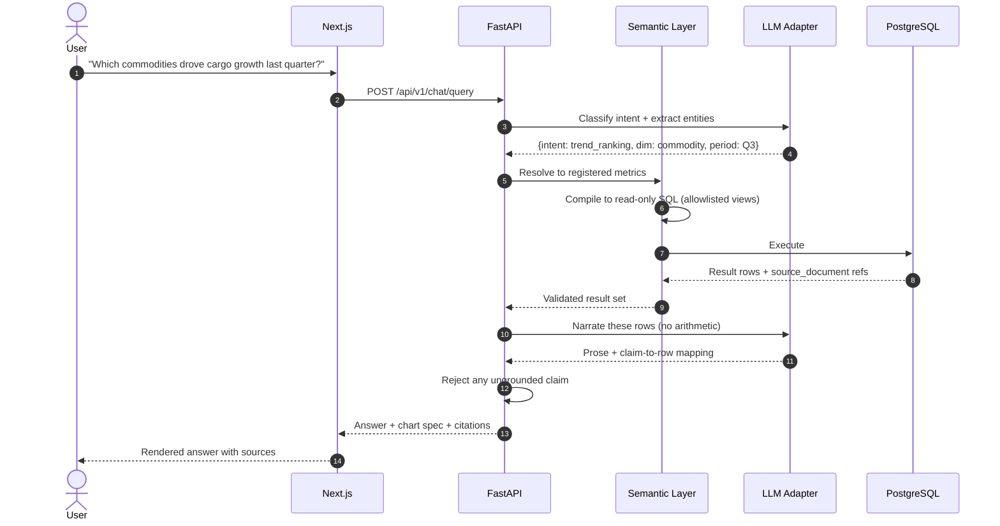
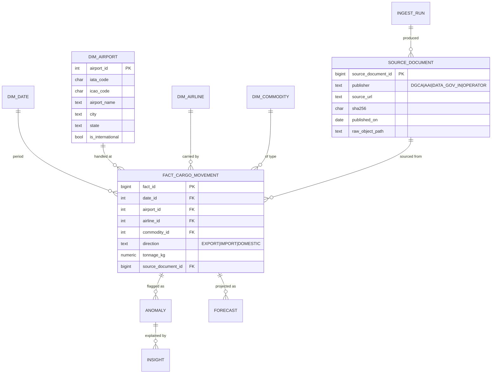

<div align="center">

# Air Cargo Intelligence

### An agentic analytics platform that turns fragmented Indian air-cargo data into ranked airports, explained anomalies, and source-cited answers.

[](#roadmap)
[](tests/)
[](LICENSE)
[](pyproject.toml)
[](web/package.json)
[](db/)
[](.)
[](https://github.com/adarshcod30/Air-Cargo-Intelligence/issues)

[**Requirements Spec**](docs/SRS.md) &nbsp;·&nbsp; [**Report Bug**](https://github.com/adarshcod30/Air-Cargo-Intelligence/issues) &nbsp;·&nbsp; [**Request Feature**](https://github.com/adarshcod30/Air-Cargo-Intelligence/issues)

</div>

---

## Table of Contents

- [Overview](#overview)
- [Key Features](#key-features)
- [Tech Stack](#tech-stack)
- [System Architecture](#system-architecture)
- [The Agent Pipeline](#the-agent-pipeline)
- [What Makes the Agents Agentic](#what-makes-the-agents-agentic)
- [Application Flow](#application-flow)
- [Data Model](#data-model)
- [Data & ML Pipeline](#data--ml-pipeline)
- [Evaluation & Acceptance Targets](#evaluation--acceptance-targets)
- [Deployment & Infrastructure](#deployment--infrastructure)
- [Project Structure](#project-structure)
- [Getting Started](#getting-started)
- [Usage / API Reference](#usage--api-reference)
- [Testing](#testing)
- [Roadmap](#roadmap)
- [Contributing](#contributing)
- [License](#license)
- [Contact](#contact)

---

## Overview

**Problem.** India's air-cargo EXIM data is public but scattered. DGCA publishes traffic statistics as PDFs, the Airports Authority of India (AAI) publishes monthly cargo reports in its own layout, `data.gov.in` exposes yet another schema, and individual airport operators publish their own numbers. The units disagree (kg vs. MT vs. tonnes), the airport identifiers disagree (IATA vs. ICAO vs. free-text city names), and the reporting periods disagree (calendar month vs. Indian fiscal year). An analyst who wants to answer *"which airports grew fastest in pharma exports last quarter?"* spends days reconciling spreadsheets before analysis even starts.

**Solution.** A pipeline of six specialised agents that ingest those sources, reconcile them into a single governed warehouse, then run statistical trend, anomaly, and forecast models over the result. A language model sits on top as a *narrator and query planner* — not as the analytics engine. Every number it reports is traced back to the source document it came from, so answers are auditable rather than plausible.

**Why it matters.** Air cargo underpins pharmaceutical supply chains, electronics exports, and e-commerce logistics. The stakeholders who need this data — aviation authorities planning terminal capacity, freight forwarders bidding on lanes, policy teams shaping export strategy — currently make those calls on stale, hand-assembled spreadsheets. The target is to cut that manual compilation effort by 60–70% and move the insight latency from weeks to minutes.

**The design principle that shapes everything below:** *the language model never computes a number.* Metrics come from SQL over a governed semantic layer; models come from `statsmodels` and `scikit-learn`. The LLM classifies intent, plans queries against an allowlisted view, and writes prose over results it is handed. This is what makes "source-cited" a real guarantee instead of a marketing line.

**Keywords:** `air-cargo` `logistics-analytics` `multi-agent-systems` `data-engineering` `etl-pipeline` `time-series-forecasting` `anomaly-detection` `text-to-sql` `fastapi` `nextjs` `postgresql` `open-government-data`

---

## Key Features

| Feature | What it does |
|---|---|
| **Multi-source ingestion** | Pulls DGCA, AAI, `data.gov.in`, and airport-operator releases on a schedule. Handles PDF table extraction, Excel, and CSV, checksums every artefact, and records full provenance. |
| **Automated reconciliation** | Canonicalises airport codes, normalises tonnage units, aligns fiscal-to-calendar periods, and deduplicates overlapping reports into one conformed fact table. |
| **Trend intelligence** | Computes YoY / MoM / CAGR, market-share shift, and seasonally adjusted growth across airport, airline, state, and commodity dimensions. |
| **Anomaly detection** | Flags unusual movements via STL residual z-scores plus an Isolation Forest ensemble, scored by severity and deduplicated against known seasonality. |
| **Root-cause narratives** | Generates a plain-language explanation for each flagged anomaly, grounded in correlated series and the source rows that triggered it. |
| **Short-term forecasting** | SARIMA and gradient-boosted baselines with rolling-origin backtesting, published with prediction intervals rather than bare point estimates. |
| **Conversational analyst** | Natural-language questions resolved through a governed semantic layer to read-only SQL, answered with inline citations to source documents. |
| **Alert feed & auto-reports** | Proactive anomaly alerts and one-click monthly/quarterly briefs with charts embedded, requiring no analyst effort. |

---

## Tech Stack

| Layer | Technology | Why |
|---|---|---|
| Frontend | Next.js 15 (App Router), TypeScript, Tailwind CSS, Recharts | Server components keep dashboard payloads small; Recharts covers the chart vocabulary without a licence. |
| API | FastAPI, Pydantic v2, Uvicorn | Typed request/response contracts that generate the OpenAPI spec the frontend consumes. |
| Agent orchestration | LangGraph | The pipeline is a stateful DAG with retries and checkpointing, not a linear script — a graph runtime models that honestly. |
| Language model | Provider-agnostic adapter over any OpenAI-compatible endpoint; Ollama (Llama 3.1 / Mistral) for offline development | Keeps the reasoning layer swappable and lets the whole stack run locally with no API spend. |
| Ingestion | `httpx`, `pdfplumber`, `camelot-py`, `openpyxl`, `pandas` | DGCA and AAI publish tabular data inside PDFs; extraction is a first-class problem, not a footnote. |
| Orchestration | Prefect 3 | Scheduled flows with observable retries and backfills for slow, flaky government endpoints. |
| Warehouse | PostgreSQL 16 (star schema) + `pgvector` | One transactional store for facts, provenance, and semantic memory. |
| Local analytics | DuckDB | Fast columnar exploration over `data/processed/` without touching the warehouse. |
| ML | `statsmodels`, `Prophet`, `scikit-learn`, `XGBoost` | Classical time-series is the right tool for ~monthly aggregates with strong seasonality and short history. |
| Cache & queue | Redis | Query result caching plus the task broker behind long-running agent runs. |
| Infra | Docker, Docker Compose | One command to stand up the entire stack including the database. |
| CI/CD | GitHub Actions | Lint, type-check, and test gates on every pull request. |
| Observability | `structlog`, Prometheus, Grafana | Per-agent run metrics, ingestion freshness, and query latency. |

---

## System Architecture

The system is four layers stacked bottom-up. **Ingestion** treats every external source as unreliable: it downloads, checksums, and archives the raw artefact before parsing, so a re-parse never requires re-fetching. **The warehouse** is the single source of truth — a star schema where every fact row carries a foreign key to the source document that produced it. **The agent pipeline** reads from and writes back to that warehouse, enriching it with trends, anomalies, forecasts, and narratives. **The serving layer** exposes all of it through a REST API that both the dashboard and the chat interface consume, so there is exactly one implementation of every metric.



---

## The Agent Pipeline

Six agents run as a directed graph. Each one reads a well-defined slice of the warehouse, writes a well-defined slice back, and records a run record so any output can be reproduced. Only the last agent calls a language model.



| Agent | Input | Output | Method |
|---|---|---|---|
| **1. Ingestion** | Source registry | Raw artefacts + `source_document` rows | Scheduled fetch, SHA-256 checksum, content-type routing to the right parser |
| **2. Cleaning & Reconciliation** | Staging tables | Conformed `fact_cargo_movement` | Code canonicalisation, unit normalisation to kilograms, fiscal-to-calendar alignment, fuzzy dedup on `(airport, period, direction, commodity)` |
| **3. Trend Analysis** | Fact table | `trend` rows | YoY / MoM / CAGR, market-share shift, STL seasonal decomposition |
| **4. Anomaly Detection** | Fact + trend | `anomaly` rows with severity | STL residual z-score, Isolation Forest ensemble, seasonality-aware suppression |
| **5. Forecast** | Fact table | `forecast` rows with intervals | SARIMA baseline, XGBoost with lag/calendar features, rolling-origin backtest |
| **6. Insight Narrative** | Anomaly + trend + forecast | `insight` rows with citations | LLM writes prose over supplied rows only; every claim carries a `source_document` reference |

> **Note on agent 6.** It receives a structured payload of already-computed rows and is instructed to explain them. It has no database access and no arithmetic responsibility. If it cannot ground a claim in the rows it was handed, the insight is rejected rather than published.

---

## What Makes the Agents Agentic

Ingestion could have been a cron job over a fixed URL list. It is not,
because the sources punish that design: AAI ships `April2k26Annex4.pdf`
next to `April2k26Anex5.pdf` (one fewer `n`), January's files carry a `_0`
suffix, and a correctly-spelled URL returns an HTML error page with
**HTTP 200**. Naming, layout and availability all drift without notice.

So each agent gets a **goal, a set of tools, and a budget**, and decides
its own next action from what it has observed:



**The policy is pluggable, and that is the point:**

| Policy | Decides by | Used when |
|---|---|---|
| `HeuristicPolicy` | deterministic rules that branch on observations | always tried first; runs in CI with no API key |
| `LLMPolicy` | asks a model to pick the next tool | only when `LLM_BASE_URL` is configured |

Heuristic-first keeps model calls rare: a monthly crawl touching hundreds
of documents should not re-derive rules we already encoded. Both policies
emit the identical `AgentRun` trace, so runs stay comparable and replayable.

**The grounding invariant is enforced structurally, not by instruction.**
A policy may only return a tool name and arguments, validated against the
registered allowlist before anything executes. It cannot return a
measurement. Numbers come from parsers; agents decide only *how to get
them*. A bad completion costs a wasted step, never a corrupted fact.

### Reflection, and what it caught

Each agent's value shows up where it changes course:

| Agent | Reflects on | Real failure it caught |
|---|---|---|
| **Discovery** | did this pattern match anything? | Falls down a ladder of looser patterns, so `Anex` is found alongside `Annex` without hard-coding the typo |
| **Extraction** | did that parser score above the floor? | Sniffs magic bytes and quarantined an HTML error page served as `.pdf` with HTTP 200 |
| **Reconciliation** | did two source names collapse onto one code? | `BENGALURU (BIAL)` and `BENGALURU (HAL)` are different airports; merging them double-counts the city |

The collision detector earned its place immediately: it caught a **wrong
ICAO code in our own curated seed file**, where Pithoragarh had been given
Pasighat's `VEPG`. A pipeline without that check would have published the
error as fact.

Every run is written to `data/processed/agent_runs.jsonl` with each tool
call, its arguments and its observation, so agent judgement is auditable
rather than trusted.

---

## Application Flow

The chat path is the most interesting one, because it is where grounding is enforced. A question never becomes free-form SQL — it is classified, mapped onto the semantic layer's registered metrics, compiled to SQL against read-only allowlisted views, and validated before a single word of prose is written.



---

## Data Model

A conventional star schema. The detail that matters is `source_document`: every fact row points at the artefact it was parsed from, which is what makes citation possible and what makes a bad source retractable in one statement.



**Why tonnage is stored in kilograms.** Sources mix kilograms, metric tonnes, and unqualified "tonnes." Normalising to the smallest unit at write time makes every downstream aggregation a plain `SUM` and removes an entire class of unit bug from the analytics layer.

---

## Data & ML Pipeline

### 1. Data sources & collection

Each source below was probed directly; status reflects what actually
responded, not what was hoped for.

| Source | Status | Format | Grain |
|---|---|---|---|
| **AAI** traffic news, Annexure IV | ✅ **live** | PDF (bilingual) | Airport × month × international/domestic/total, in MT |
| **Eurostat** `avia_gooa` | ✅ **live** | JSON-stat API | Airport × year × coverage, in tonnes |
| **OpenFlights** crosswalk | ✅ **live** | CSV | 7,698 airports — reference data, not cargo |
| **`data.gov.in`** (OGD) | 🔑 needs one free key | REST catalogue + REST | 373 aviation datasets, discovered via the catalogue API and pulled by `resource_id` |
| **DGCA** traffic statistics | ↩︎ covered via OGD | — | DGCA data is republished on `data.gov.in`, so the JS portal need not be scraped |
| **World Bank** `IS.AIR.GOOD.MT.K1` | ⚠️ degraded | REST | Endpoint timed out repeatedly from our network |

**On the OGD platform key.** One API key covers the entire platform - this
was verified against the live API, not assumed. Datasets are addressed by
`resource_id` (a UUID), so nothing needs downloading by hand: the
catalogue endpoint is paged once to discover every air-cargo resource,
then each is pulled with the same key. A dataset qualifies only if it
matches **both** an aviation term and a cargo term, so railway freight
and airport passenger tables are excluded rather than swept in.

A useful side effect: DGCA's statistics are republished on the OGD
platform, so the DGCA portal - whose report links are rendered
client-side and expose no static hrefs - does not need to be scraped.

AAI publishes freight as **Annexure IV**, split IV-A international, IV-B
domestic, IV-C total. Section headings appear only on the first page of
each section, so continuation pages inherit state. Airport cells are
bilingual in a single cell (`अमृतसर AMRITSAR`), and values are metric
tonnes converted to kilograms on the way in.

Every fetch is checksummed and archived to `data/raw/` before parsing, so parser changes can be replayed over history without re-hitting a government endpoint.

### 2. Cleaning

- **Airport identity.** Canonicalise IATA / ICAO / free-text city names against a curated `dim_airport` crosswalk; unresolved names are quarantined for manual mapping rather than silently dropped.
- **Units.** Detect and normalise kg / MT / tonnes to kilograms. Where a source is ambiguous, magnitude heuristics against the airport's historical range flag it for review.
- **Periods.** Convert Indian fiscal-year reporting (April–March) to calendar months so sources are comparable.
- **Deduplication.** Overlapping reports are resolved on `(airport, period, direction, commodity)` with a publisher-precedence rule; the losing row is retained and marked superseded, never deleted.
- **Validation.** Great Expectations-style assertions gate the load: non-negative tonnage, referential integrity, and period-over-period change within a plausible band.

### 3. Transformation & feature engineering

Engineered for the forecast and anomaly models:

- Calendar features — month, quarter, fiscal period, festival and holiday flags, working days.
- Lag features — t-1, t-3, t-12 tonnage, plus rolling 3- and 12-month means.
- Share features — airport share of national tonnage, commodity share of airport tonnage.
- Seasonal decomposition — STL trend, seasonal, and residual components as explicit columns.
- Growth features — YoY, MoM, and 3-month CAGR per series.

### 4. Model training

| Task | Baseline | Candidate | Selection |
|---|---|---|---|
| Forecast | Seasonal naive | SARIMA, Prophet, XGBoost on lag features | Lowest MAPE under rolling-origin backtest |
| Anomaly | Fixed ±2σ threshold | STL residual z-score + Isolation Forest ensemble | Highest precision at fixed recall on a labelled review set |

Splitting is strictly **time-based** — a random split would leak future information into training and produce forecast scores that cannot survive contact with production. Hyperparameters are tuned with Optuna over the backtest objective, and runs are tracked in MLflow.

### 5. Evaluation

- **Forecast:** MAPE and sMAPE as headline metrics, RMSE for scale sensitivity, and prediction-interval coverage to confirm the intervals mean what they claim.
- **Anomaly:** precision, recall, and F1 against a hand-labelled set of known cargo events; false-positive rate is the metric that decides whether the alert feed is worth reading.
- **Chat:** exact-match accuracy on a fixed question bank with known answers, plus **citation validity** — the share of numeric claims that resolve to a real source row. This is the gate that keeps the assistant honest.

---

## Evaluation & Acceptance Targets

> **Ingestion rows are measured; model rows are still targets.** The
> ingestion layer runs, so its numbers below come from an actual run
> (`data/processed/pipeline_report.json`). No model has been trained yet,
> so forecast, anomaly and chat rows remain thresholds marked _pending_
> rather than invented figures.

| Component | Metric | Baseline to beat | Acceptance target | Measured |
|---|---|---|---|---|
| Forecast | MAPE (3-month horizon) | Seasonal naive | ≤ 12% | _pending_ |
| Forecast | 80% interval coverage | — | 75–85% | _pending_ |
| Anomaly | Precision @ 80% recall | ±2σ threshold | ≥ 0.70 | _pending_ |
| Anomaly | False positives / month | — | ≤ 5 | _pending_ |
| Chat | Answer accuracy (question bank) | — | ≥ 90% | _pending_ |
| Chat | Citation validity | — | 100% | _pending_ |
| Ingestion | Rows reconciled without manual mapping | — | ≥ 95% | **100%** (2,411/2,411) |
| Ingestion | Documents extracted without quarantine | — | ≥ 90% | **100%** (15/15) |
| Ingestion | Airport-code collisions or duplicate keys | — | 0 | **0** |
| Ingestion | INTL + DOM = TOTAL cross-check | — | ≥ 99% | **100%** (358/358) |
| Ingestion | Pipeline freshness after source publish | — | ≤ 24h | _pending_ |

**Current dataset:** 2,411 reconciled facts covering **153 airports across
5 countries and 9 reporting periods**, from 15 source documents,
produced by 17 traced agent runs totalling 84 tool calls. The `INTL + DOM = TOTAL`
figure is an independent cross-check: it recomputes the identity from the
stored rows rather than trusting the parser that wrote them.

Citation validity is set at 100% deliberately. A single uncited number in an auditable analytics product is a defect, not a tuning parameter.

---

## Deployment & Infrastructure

- **Local development:** `docker compose up` brings up PostgreSQL, Redis, the API, the Prefect worker, and the web app. Ollama is optional and lets the full stack run with no external API calls.
- **Containerisation:** multi-stage Dockerfiles — a Python image for API, agents, and worker; a Node image for the Next.js build.
- **Environments:** `dev` (compose, sample data), `staging` (full pipeline, restricted sources), `prod` (scheduled ingestion, public dashboards).
- **CI/CD:** GitHub Actions runs `ruff`, `mypy`, `pytest`, and `tsc` on every pull request; merges to `main` build and publish images.
- **Migrations:** Alembic, applied on deploy and version-controlled under `db/migrations/`.
- **Monitoring:** Prometheus scrapes agent-run duration, ingestion freshness, and query latency; Grafana dashboards and alerts on stale sources or failed runs.
- **Scaling:** the warehouse is the bottleneck before the models are. Fact tables are partitioned by period, hot aggregates are materialised, and Redis caches dashboard queries. Agent runs are queued, so a slow forecast never blocks ingestion.
- **Secrets:** supplied by environment only. Nothing sensitive is committed — see `.env.example` for the required keys.

---

## Project Structure

```
Air-Cargo-Intelligence/
├── docs/SRS.md               # Full requirements specification
├── data/
│   ├── raw/                  # Content-addressed source artefacts + _ledger.jsonl
│   ├── interim/
│   └── processed/            # cargo_facts.jsonl, agent_runs.jsonl, report
├── db/seeds/
│   ├── airports.csv          # OpenFlights crosswalk (7,698 airports)
│   └── airport_aliases.csv   # Curated overlay: renames + UDAN-era airports
├── services/
│   ├── common/               # Domain models, config, logging
│   ├── ingestion/
│   │   ├── registry.py       # Source registry with honest per-source status
│   │   ├── fetcher.py        # Magic-byte content verification
│   │   ├── store.py          # Raw archive + provenance ledger
│   │   ├── normalise.py      # Units, airport identity, periods
│   │   ├── seed.py           # Builds the airport crosswalk
│   │   └── parsers/          # aai_freight, eurostat_freight, registry
│   └── agents/
│       ├── base.py           # The agent loop: goal, tools, budget, trace
│       ├── policy.py         # HeuristicPolicy + LLMPolicy
│       ├── discovery_agent.py
│       ├── extraction_agent.py
│       ├── reconciliation_agent.py
│       └── orchestrator.py   # Pipeline + CLI
├── tests/
│   ├── unit/                 # 53 tests
│   └── fixtures/             # Golden AAI PDF — the layout-change tripwire
├── pyproject.toml
└── README.md
```

## Getting Started

> **Project status:** the architecture, data model, and specification are complete. Implementation is in progress — the commands below describe the intended developer workflow and will land alongside the services they invoke. Track progress in the [roadmap](#roadmap).

### Prerequisites

- Python 3.11+
- Node.js 20+
- Docker and Docker Compose
- PostgreSQL 16 (or use the bundled compose service)

### Installation

```bash
git clone https://github.com/adarshcod30/Air-Cargo-Intelligence.git
cd Air-Cargo-Intelligence

# Python services
python -m venv .venv && source .venv/bin/activate
pip install -e ".[dev]"

# Web app
cd web && npm install && cd ..
```

### Environment variables

```bash
cp .env.example .env
```

| Key | Purpose |
|---|---|
| `DATABASE_URL` | PostgreSQL connection string |
| `REDIS_URL` | Cache and task broker |
| `LLM_BASE_URL` | Any OpenAI-compatible endpoint (or a local Ollama URL) |
| `LLM_API_KEY` | Omit when running against a local model |
| `LLM_MODEL` | Model identifier used by the narrative and planner agents |
| `PREFECT_API_URL` | Orchestration server |

### Run the ingestion pipeline

```bash
# 1. Build the airport crosswalk (fetches OpenFlights, ~7,700 airports)
python -m services.agents.orchestrator --seed
```

```bash
# 2. Ingest AAI monthly freight reports
python -m services.agents.orchestrator --source aai_freight --limit 6
```

```bash
# 3. Ingest every live source, India and Europe
python -m services.agents.orchestrator --all --limit 8
```

Output lands in `data/processed/`:

| File | Contents |
|---|---|
| `cargo_facts.jsonl` | Reconciled facts, tonnage in kilograms, each with a `source_document_id` |
| `agent_runs.jsonl` | Every agent run: each tool call, its arguments and its observation |
| `pipeline_report.json` | Run summary, resolution methods, and any review queue |

A run with no model configured uses the deterministic policy and needs no
API key. Set `LLM_BASE_URL`, `LLM_MODEL` and optionally `LLM_API_KEY` to
let the model policy handle documents the heuristics do not anticipate.

## Usage / API Reference

| Method | Endpoint | Description |
|---|---|---|
| `GET` | `/api/v1/airports/rankings` | Airports ranked by tonnage or growth for a period |
| `GET` | `/api/v1/commodities/trends` | Commodity-level trend series with share shift |
| `GET` | `/api/v1/airlines/share` | Airline cargo market share over time |
| `GET` | `/api/v1/anomalies` | Detected anomalies, filterable by severity and dimension |
| `GET` | `/api/v1/forecasts` | Forecast series with prediction intervals |
| `POST` | `/api/v1/chat/query` | Natural-language question → grounded answer with citations |
| `POST` | `/api/v1/reports/generate` | Generate a monthly or quarterly brief |
| `GET` | `/api/v1/sources` | Ingested source documents and freshness |

```bash
curl -X POST http://localhost:8000/api/v1/chat/query \
  -H "Content-Type: application/json" \
  -d '{"question": "Show the top 5 cargo airports by growth in the last quarter"}'
```

```jsonc
{
  "answer": "Bengaluru (BLR) led growth at 18.2% YoY, followed by Hyderabad (HYD) at 15.4% ...",
  "chart": { "type": "bar", "x": "airport", "y": "growth_yoy" },
  "rows": [
    { "airport": "BLR", "tonnage_kg": 3073000, "growth_yoy": 0.182 }
  ],
  "citations": [
    { "claim": "Bengaluru led growth at 18.2% YoY",
      "source_document_id": 412,
      "publisher": "AAI",
      "published_on": "2025-10-15" }
  ]
}
```

---

## Testing

```bash
pytest -q                 # 53 tests
ruff check services tests
```

The suite is ordered by bugs-caught-per-effort, and every case in it comes
from a failure actually observed against live data:

- **Golden-fixture parser tests** — `tests/fixtures/aai_annex4_sample.pdf`
  is a real AAI page. If AAI reshapes the table, CI fails instead of the
  pipeline silently ingesting nothing.
- **Content-verification tests** — an HTML error page served as `.pdf`
  with HTTP 200 must be refused, not parsed.
- **Reconciliation tests** — `DELHI` must resolve to Indira Gandhi (DEL),
  not to Safdarjung; `BENGALURU (HAL)` must stay distinct from Kempegowda.
- **Unit tests** — an unknown mass unit raises rather than defaulting,
  because a silent wrong unit rescales every number downstream.

## Roadmap

**Phase 1 · Foundation (current)**
- [x] Requirements specification and system architecture
- [x] Data model and provenance design
- [x] Agent loop with pluggable heuristic / model policies
- [x] Discovery, extraction and reconciliation agents with full run traces
- [x] AAI freight parser (bilingual PDF) and Eurostat JSON-stat parser
- [x] Airport crosswalk + curated alias overlay; 100% reconciliation
- [x] Golden-fixture test suite (53 tests)
- [ ] PostgreSQL warehouse schema and Alembic migrations
- [ ] DGCA discovery via rendered crawl; `data.gov.in` API key

**Phase 2 · Intelligence**
- [ ] Trend, anomaly, and forecast agents with backtesting
- [ ] Semantic layer and metric registry
- [ ] Grounded chat with citation enforcement
- [ ] Dashboards, alert feed, auto-generated reports

**Phase 3 · Scale**
- [ ] Global cargo sources (IATA, Eurostat)
- [ ] Route-level and lane-level intelligence
- [ ] Multi-modal expansion into maritime and rail freight

See [open issues](https://github.com/adarshcod30/Air-Cargo-Intelligence/issues) for the working list.

---

## Contributing

Contributions are welcome.

1. Fork the project
2. Create a feature branch (`git checkout -b feature/your-feature`)
3. Commit your changes
4. Push and open a pull request

Please run `ruff check`, `mypy`, and `pytest` before opening a PR. New parsers must ship with a golden fixture.

---

## License

Distributed under the MIT License. See [`LICENSE`](LICENSE) for details.

---

## Contact

**Adarsh Dwivedi** — [@adarshcod30](https://github.com/adarshcod30) · 23ucs509@lnmiit.ac.in

Built with Anish Laddha, Hiitesh Gour, and Charu Chhabra at The LNM Institute of Information Technology, Jaipur.

Project link: [https://github.com/adarshcod30/Air-Cargo-Intelligence](https://github.com/adarshcod30/Air-Cargo-Intelligence)
