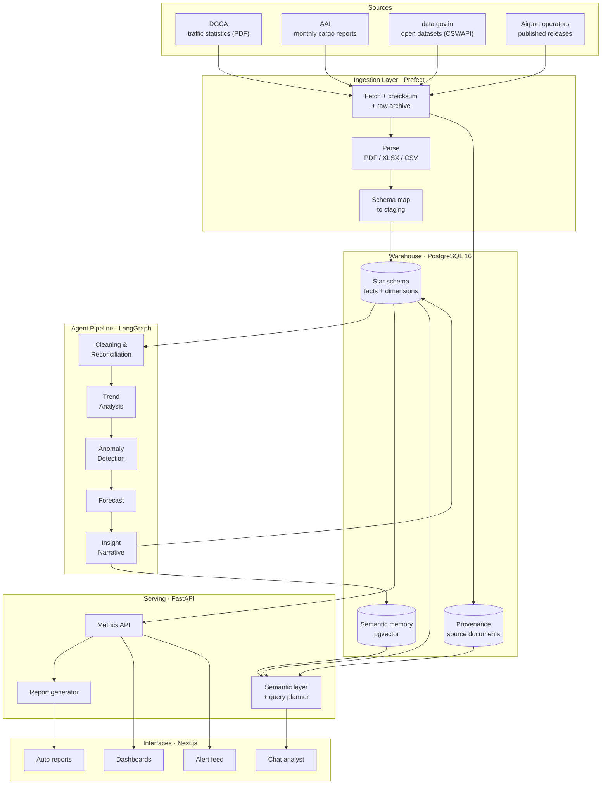
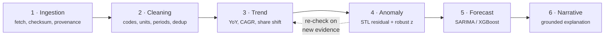
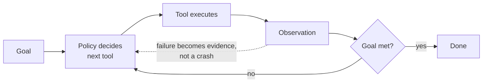
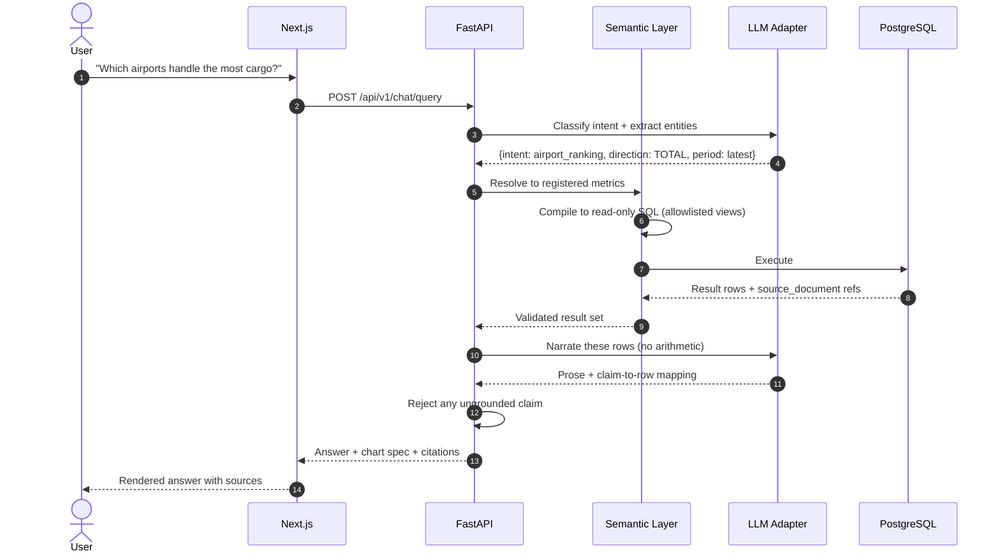
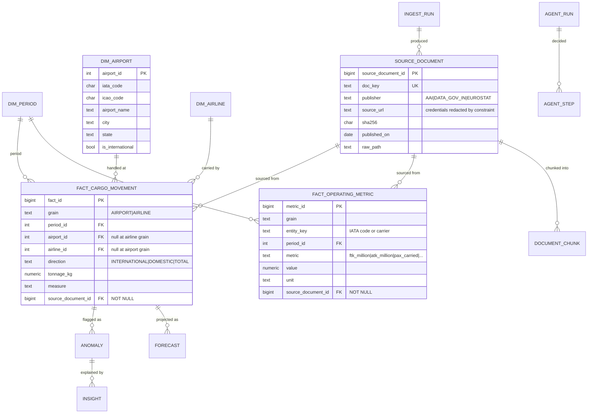
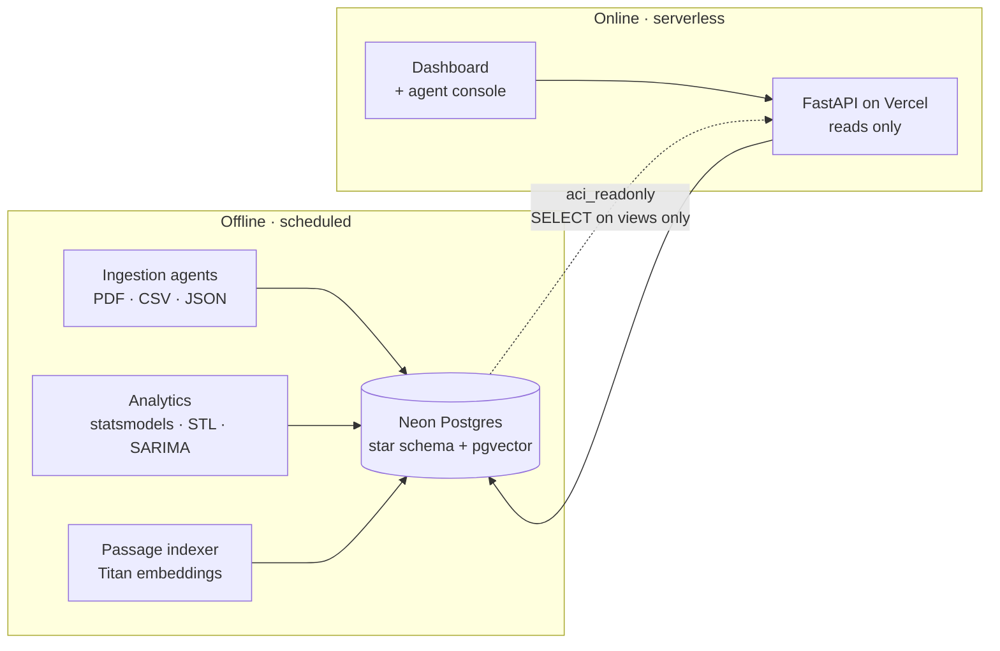

<div align="center">

# Air Cargo Intelligence

### An agentic analytics platform that turns fragmented Indian air-cargo data into ranked airports, explained anomalies, and source-cited answers.

[](#roadmap)
[](tests/)
[](LICENSE)
[](pyproject.toml)
[](db/)
[](.)
[](https://github.com/adarshcod30/Air-Cargo-Intelligence/issues)

[**Live demo**](https://air-cargo-intelligence.vercel.app) &nbsp;·&nbsp; [**Agent console**](https://air-cargo-intelligence.vercel.app/#agents) &nbsp;·&nbsp; [**API docs**](https://air-cargo-intelligence.vercel.app/docs) &nbsp;·&nbsp; [**Requirements Spec**](docs/SRS.md) &nbsp;·&nbsp; [**Sample brief**](docs/assets/sample-brief.md)

`agentic-ai` · `rag` · `aws-bedrock` · `pgvector` · `time-series-forecasting` · `anomaly-detection` · `fastapi` · `postgresql`

</div>

---

## Table of Contents

- [Overview](#overview)
- [Key Features](#key-features)
- [Tech Stack](#tech-stack)
- [System Architecture](#system-architecture)
- [The Agent Pipeline](#the-agent-pipeline)
- [What Makes the Agents Agentic](#what-makes-the-agents-agentic)
- [Application Flow](#application-flow)
- [Data Model](#data-model)
- [Data & ML Pipeline](#data--ml-pipeline)
- [Evaluation & Acceptance Targets](#evaluation--acceptance-targets)
- [Deployment & Infrastructure](#deployment--infrastructure)
- [Project Structure](#project-structure)
- [Getting Started](#getting-started)
- [Usage / API Reference](#usage--api-reference)
- [Testing](#testing)
- [Roadmap](#roadmap)
- [Contributing](#contributing)
- [License](#license)
- [Contact](#contact)

---

## Overview

**Problem.** India's air-cargo EXIM data is public but scattered. DGCA publishes traffic statistics as PDFs, the Airports Authority of India (AAI) publishes monthly cargo reports in its own layout, `data.gov.in` exposes yet another schema, and individual airport operators publish their own numbers. The units disagree (kg vs. MT vs. tonnes), the airport identifiers disagree (IATA vs. ICAO vs. free-text city names), and the reporting periods disagree (calendar month vs. Indian fiscal year). An analyst who wants to answer *"which airports grew fastest in pharma exports last quarter?"* spends days reconciling spreadsheets before analysis even starts.

**Solution.** A pipeline of six specialised agents that ingest those sources, reconcile them into a single governed warehouse, then run statistical trend, anomaly, and forecast models over the result. A language model sits on top as a *narrator and query planner* — not as the analytics engine. Every number it reports is traced back to the source document it came from, so answers are auditable rather than plausible.

**Why it matters.** Air cargo underpins pharmaceutical supply chains, electronics exports, and e-commerce logistics. The stakeholders who need this data — aviation authorities planning terminal capacity, freight forwarders bidding on lanes, policy teams shaping export strategy — currently make those calls on stale, hand-assembled spreadsheets. The target is to cut that manual compilation effort by 60–70% and move the insight latency from weeks to minutes.

**The design principle that shapes everything below:** *the language model never computes a number.* Metrics come from SQL over a governed semantic layer; models come from `statsmodels`. The LLM classifies intent, plans queries against an allowlisted view, and writes prose over results it is handed. This is what makes "source-cited" a real guarantee instead of a marketing line.

**Keywords:** `air-cargo` `logistics-analytics` `multi-agent-systems` `data-engineering` `etl-pipeline` `time-series-forecasting` `anomaly-detection` `text-to-sql` `fastapi` `nextjs` `postgresql` `open-government-data`

---

## Key Features

| Feature | What it does |
|---|---|
| **Multi-source ingestion** | Pulls DGCA, AAI, `data.gov.in`, and airport-operator releases on a schedule. Handles PDF table extraction, Excel, and CSV, checksums every artefact, and records full provenance. |
| **Automated reconciliation** | Canonicalises airport codes, normalises tonnage units, aligns fiscal-to-calendar periods, and deduplicates overlapping reports into one conformed fact table. |
| **Trend intelligence** | Computes YoY / MoM / CAGR, market-share shift and seasonally adjusted growth across airport, airline and direction. |
| **Operating efficiency** | Cargo load factor (freight tonne-km over capacity offered), tonnes lifted per departure, mail share and freight per passenger — the measures that separate a freighter from a belly hold. Blue Dart runs at 68% and 20.6 t/departure; Go Air at 5.2% and 0.88. |
| **Growth attribution** | Decomposes national change into per-airport contributions measured against the *national* base, so the parts sum to the national figure rather than merely ranking movers. Delhi accounts for 2.93 points of the 11.30% rise; Kolkata for −0.28. |
| **Growth decomposition** | Freight is flights multiplied by tonnes per flight, so a year's change splits exactly into a capacity effect and an intensity effect. Chennai grew 10.3% while losing 2,258 flights, because each remaining departure carried a third more. |
| **Market concentration** | Herfindahl–Hirschman index reported with the effective number of equally sized airports beside it, because an HHI communicates nothing on its own. |
| **Anomaly detection** | Flags unusual movements two ways and records which fired: `stl_residual` removes seasonality before scoring, `robust_z` uses median and MAD rather than mean and standard deviation so one spike cannot hide the next, and `consensus` marks the months both agree on. |
| **Root-cause narratives** | Generates a plain-language explanation for each flagged anomaly, grounded in correlated series and the source rows that triggered it. |
| **Short-term forecasting** | SARIMA and gradient-boosted baselines with rolling-origin backtesting, published with prediction intervals rather than bare point estimates. |
| **Conversational analyst** | Natural-language questions resolved through a governed semantic layer to read-only SQL, answered with inline citations to source documents. |
| **Alert feed & auto-reports** | Proactive anomaly alerts and one-click monthly/quarterly briefs with charts embedded, requiring no analyst effort. |
| **Agent console** | Every agent run is a warehouse row: the goal, each tool call in order, the reasoning behind the choice, what came back, and which policy decided it. Replays step by step over SSE. This is the difference between claiming an architecture is agentic and being able to show it. |
| **Hybrid retrieval** | 1,410 passages from the source PDFs and open-data payloads, indexed with `pgvector` (HNSW, cosine) and Postgres full text, fused on rank. Upgrades a citation from "this document" to "this paragraph, this page". |
| **Policy A/B harness** | Runs the same goal over the same documents under the deterministic policy and the model policy, and reports steps, success rate, latency and token spend. Reports *"not a comparison"* when no model call succeeded, rather than presenting noise as a result. |

---

## Tech Stack

Only what the code actually uses. Anything aspirational lives in the
roadmap instead, because a stack table that lists tools the project does
not import is a claim a reader cannot check.

| Layer | Technology | Why |
|---|---|---|
| Dashboard | Single-page app served by the API, inline SVG | No framework and no build step. One bar chart does not justify a charting dependency, and same-origin removes the CORS dance. |
| API | FastAPI, Pydantic v2, Uvicorn | Typed contracts that generate the OpenAPI spec the dashboard consumes. |
| Agents | Custom loop with pluggable policies | A goal, tools, a budget and a recorded trace. The policy is heuristic by default and a language model when one is configured. |
| Reasoning layer | AWS Bedrock, Converse API | One request shape across Nova, Llama and Mistral, so swapping the model is a config change. Used only to choose a tool or narrate supplied rows — never to compute a figure. |
| Retrieval | `pgvector` (HNSW), Postgres FTS, Titan embeddings | Dense and lexical retrievers fail differently; fusing them on rank fixes queries that either alone gets wrong. Falls back to an offline hashed TF-IDF embedder with no credentials. |
| Ingestion | `httpx`, `pdfplumber`, `pandas` | DGCA and AAI publish tabular data inside PDFs; extraction is a first-class problem here, not a footnote. |
| Warehouse | PostgreSQL 17, SQLAlchemy, Alembic | One store for facts, provenance and agent output, with the guarantees held in the schema. |
| Analytics | `statsmodels` (SARIMAX, STL), `numpy` | Classical time series suits monthly aggregates with strong seasonality and short history. No deep model is used, and none is warranted at 36 months of data. |
| Hosting | Vercel (serverless) + Neon Postgres | The read path imports no analytics, so it fits a serverless function; forecasts arrive as rows. Chosen over a sleeping free tier so a portfolio link is always warm. |
| Scheduling | Plain scheduler + GitHub Actions cron | One linear daily chain over a few public endpoints. A workflow engine would add a dependency without removing a problem. |
| Observability | Prometheus exposition at `/metrics` | Fact counts, source staleness and last-run status. |
| CI | GitHub Actions | Lint, type-check and the suite against a real Postgres on every push. |

## System Architecture

The system is four layers stacked bottom-up. **Ingestion** treats every external source as unreliable: it downloads, checksums, and archives the raw artefact before parsing, so a re-parse never requires re-fetching. **The warehouse** is the single source of truth — a star schema where every fact row carries a foreign key to the source document that produced it. **The agent pipeline** reads from and writes back to that warehouse, enriching it with trends, anomalies, forecasts, and narratives. **The serving layer** exposes all of it through a REST API that both the dashboard and the chat interface consume, so there is exactly one implementation of every metric.



---

## The Agent Pipeline

Six agents run as a directed graph. Each one reads a well-defined slice of the warehouse, writes a well-defined slice back, and records a run record so any output can be reproduced. Only the last agent calls a language model.



| Agent | Input | Output | Method |
|---|---|---|---|
| **1. Ingestion** | Source registry | Raw artefacts + `source_document` rows | Scheduled fetch, SHA-256 checksum, content-type routing to the right parser |
| **2. Cleaning & Reconciliation** | Staging tables | Conformed `fact_cargo_movement` | Code canonicalisation, unit normalisation to kilograms, fiscal-to-calendar alignment, deduplication on the natural key `(grain, period, airport, airline, direction, publisher, measure)`, declared `NULLS NOT DISTINCT` because Postgres treats NULLs as distinct by default and a null airline would otherwise let the same airport month be inserted twice |
| **3. Trend Analysis** | Fact table | `trend` rows | YoY / MoM / CAGR, market-share shift, STL seasonal decomposition |
| **4. Anomaly Detection** | Fact + trend | `anomaly` rows with severity | STL residual z-score, robust (median/MAD) z-score, consensus of the two, with guards against launch curves reading as growth |
| **5. Forecast** | Fact table | `forecast` rows with intervals | SARIMA baseline, XGBoost with lag/calendar features, rolling-origin backtest |
| **6. Insight Narrative** | Anomaly + trend + forecast | `insight` rows with citations | LLM writes prose over supplied rows only; every claim carries a `source_document` reference |

> **Note on agent 6.** It receives a structured payload of already-computed rows and is instructed to explain them. It has no database access and no arithmetic responsibility. If it cannot ground a claim in the rows it was handed, the insight is rejected rather than published.

---

## What Makes the Agents Agentic

Ingestion could have been a cron job over a fixed URL list. It is not,
because the sources punish that design: AAI ships `April2k26Annex4.pdf`
next to `April2k26Anex5.pdf` (one fewer `n`), January's files carry a `_0`
suffix, and a correctly-spelled URL returns an HTML error page with
**HTTP 200**. Naming, layout and availability all drift without notice.

So each agent gets a **goal, a set of tools, and a budget**, and decides
its own next action from what it has observed:



**The policy is pluggable, and that is the point:**

| Policy | Decides by | Used when |
|---|---|---|
| `HeuristicPolicy` | deterministic rules that branch on observations | always tried first; runs in CI with no API key |
| `LLMPolicy` | asks a model to pick the next tool | only when `LLM_BASE_URL` is configured |

Heuristic-first keeps model calls rare: a monthly crawl touching hundreds
of documents should not re-derive rules we already encoded. Both policies
emit the identical `AgentRun` trace, so runs stay comparable and replayable.

**The grounding invariant is enforced structurally, not by instruction.**
A policy may only return a tool name and arguments, validated against the
registered allowlist before anything executes. It cannot return a
measurement. Numbers come from parsers; agents decide only *how to get
them*. A bad completion costs a wasted step, never a corrupted fact.

### Reflection, and what it caught

Each agent's value shows up where it changes course:

| Agent | Reflects on | Real failure it caught |
|---|---|---|
| **Discovery** | did this pattern match anything? | Falls down a ladder of looser patterns, so `Anex` is found alongside `Annex` without hard-coding the typo |
| **Extraction** | did that parser score above the floor? | Sniffs magic bytes and quarantined an HTML error page served as `.pdf` with HTTP 200 |
| **Reconciliation** | did two source names collapse onto one code? | `BENGALURU (BIAL)` and `BENGALURU (HAL)` are different airports; merging them double-counts the city |

The collision detector earned its place immediately: it caught a **wrong
ICAO code in our own curated seed file**, where Pithoragarh had been given
Pasighat's `VEPG`. A pipeline without that check would have published the
error as fact.

Every run is written to `data/processed/agent_runs.jsonl` with each tool
call, its arguments and its observation, so agent judgement is auditable
rather than trusted.

---

## Application Flow

The chat path is the most interesting one, because it is where grounding is enforced. A question never becomes free-form SQL — it is classified, mapped onto the semantic layer's registered metrics, compiled to SQL against read-only allowlisted views, and validated before a single word of prose is written.



---

## Data Model

A conventional star schema. The detail that matters is `source_document`: every fact row points at the artefact it was parsed from, which is what makes citation possible and what makes a bad source retractable in one statement.



**Why tonnage is stored in kilograms.** Sources mix kilograms, metric tonnes, and unqualified "tonnes." Normalising to the smallest unit at write time makes every downstream aggregation a plain `SUM` and removes an entire class of unit bug from the analytics layer.

---

## Data & ML Pipeline

### 1. Data sources & collection

> The traffic release publishes several annexures from one page. Only
> Annexure IV, the freight tables, was read for most of this project's life;
> an early probe for the others requested lowercase filenames, got a 404,
> and the absence was recorded as "not published" rather than "wrong URL".
> Annexure II (aircraft movements) and III (passengers) are published in the
> same layout and are now ingested — 19,905 rows across 65 documents and 140
> airports. They are the denominators freight had been missing.


Each source below was probed directly; status reflects what actually
responded, not what was hoped for.

| Source | Status | Format | Grain |
|---|---|---|---|
| **AAI** traffic news, Annexure IV | ✅ **live** | PDF (bilingual) | Airport × month × international/domestic/total, in MT |
| **Eurostat** `avia_gooa` | ✅ **live** | JSON-stat API | Airport × year × coverage, in tonnes |
| **OpenFlights** crosswalk | ✅ **live** | CSV | 7,698 airports — reference data, not cargo |
| **`data.gov.in`** (OGD) | ✅ live with one free key | REST catalogue + REST | 373 aviation datasets → 146 air-cargo, **airline × fiscal year** |
| **DGCA** traffic statistics | ↩︎ covered via OGD | — | DGCA data is republished on `data.gov.in`, so the JS portal need not be scraped |
| **World Bank** `IS.AIR.GOOD.MT.K1` | ⚠️ degraded | REST | Endpoint timed out repeatedly from our network |

### Two grains, not one

The sources measure different things, and the model records which:

| Grain | Source | Answers |
|---|---|---|
| **Airport** × month | AAI, Eurostat | *Which airports are growing?* |
| **Airline** × fiscal year | data.gov.in (DGCA) | *Which carriers are growing?* |

Every cargo-bearing dataset in the OGD aviation catalogue turned out to be
airline-level: 141 of them carry no airport column at all and name the
carrier only in the dataset title. That is not a gap in the source, it is
a second grain, and it supplies the airline dimension no other source
provides. Forcing it into the airport shape, or discarding it, would both
have been wrong - so `CargoFact` records its `grain`.

**On the OGD platform key.** One API key covers the entire platform - this
was verified against the live API, not assumed. Datasets are addressed by
`resource_id` (a UUID), so nothing needs downloading by hand: the
catalogue endpoint is paged once to discover every air-cargo resource,
then each is pulled with the same key. A dataset qualifies only if it
matches **both** an aviation term and a cargo term, so railway freight
and airport passenger tables are excluded rather than swept in.

A useful side effect: DGCA's statistics are republished on the OGD
platform, so the DGCA portal - whose report links are rendered
client-side and expose no static hrefs - does not need to be scraped.

AAI publishes freight as **Annexure IV**, split IV-A international, IV-B
domestic, IV-C total. Section headings appear only on the first page of
each section, so continuation pages inherit state. Airport cells are
bilingual in a single cell (`अमृतसर AMRITSAR`), and values are metric
tonnes converted to kilograms on the way in.

Every fetch is checksummed and archived to `data/raw/` before parsing, so parser changes can be replayed over history without re-hitting a government endpoint.

### 2. Cleaning

- **Airport identity.** Canonicalise IATA / ICAO / free-text city names against a curated `dim_airport` crosswalk; unresolved names are quarantined for manual mapping rather than silently dropped.
- **Units.** Detect and normalise kg / MT / tonnes to kilograms. Where a source is ambiguous, magnitude heuristics against the airport's historical range flag it for review.
- **Periods.** Convert Indian fiscal-year reporting (April–March) to calendar months so sources are comparable.
- **Deduplication.** Overlapping reports are resolved by the natural key `(grain, period, airport, airline, direction, publisher, measure)`, enforced by a unique constraint declared `NULLS NOT DISTINCT`. Postgres treats NULLs as distinct by default, so without that clause a null `airline_id` would let the same airport month be inserted twice — which is exactly how `BENGALURU (BIAL)` and Frankfurt were double-counted before it was added. A republished month overwrites rather than appends, so a correction fully supersedes the original.
- **Validation.** Great Expectations-style assertions gate the load: non-negative tonnage, referential integrity, and period-over-period change within a plausible band.

### 3. Transformation & feature engineering

Engineered for the forecast and anomaly models:

- Calendar features — month, quarter, fiscal period, festival and holiday flags, working days.
- Lag features — t-1, t-3, t-12 tonnage, plus rolling 3- and 12-month means.
- Share features — airport share of national tonnage, commodity share of airport tonnage.
- Seasonal decomposition — STL trend, seasonal, and residual components as explicit columns.
- Growth features — YoY, MoM, and 3-month CAGR per series.

### 4. Model training

| Task | Baseline | Candidate | Selection |
|---|---|---|---|
| Forecast | Seasonal naive | SARIMA, Prophet, XGBoost on lag features | Lowest MAPE under rolling-origin backtest |
| Anomaly | Fixed ±2σ threshold | STL residual z-score, robust (median/MAD) z-score, and the consensus of the two | Mean and standard deviation are themselves moved by the outlier being looked for; median and MAD are not. Guards on baseline size, non-zero fraction and median-to-max ratio stop a launch curve reading as growth |

Splitting is strictly **time-based** — a random split would leak future information into training and produce forecast scores that cannot survive contact with production. Hyperparameters are tuned with Optuna over the backtest objective, and runs are tracked in MLflow.

### 5. Evaluation

- **Forecast:** MAPE and sMAPE as headline metrics, RMSE for scale sensitivity, and prediction-interval coverage to confirm the intervals mean what they claim.
- **Anomaly:** precision, recall, and F1 against a hand-labelled set of known cargo events; false-positive rate is the metric that decides whether the alert feed is worth reading.
- **Chat:** exact-match accuracy on a fixed question bank with known answers, plus **citation validity** — the share of numeric claims that resolve to a real source row. This is the gate that keeps the assistant honest.

---

## Why there is no commodity breakdown

The obvious question of an air-cargo product is *which goods are driving
growth*. It is not answerable from India's open data, and the reason is
worth stating precisely rather than asserting that the data "does not
exist".

Commodity-wise trade **is** published — `Principal Commodity wise Export`
and its import counterpart, under Commerce rather than Aviation. Its
columns are `commodity, country, unit, quantity_, value_us_million_`.
There is no transport mode. Sea carries the large majority of India's trade
by weight, so those figures inside an air-cargo product would imply an air
attribution the source cannot support — a number that looks like an answer
and is not. Commodity-wise cargo traffic is published for **sea ports**,
not for airports.

What the data does support is asked instead, in two forms: **attribution**
answers *where* the growth came from, and **decomposition** answers *how* —
more flights, or fuller ones. Both are exact rather than indicative: the
contributions sum to the national change, and the two effects sum to the
airport's change.

---

## Does the model actually choose better than the rules?

The architecture claims two interchangeable policies. That claim went
unmeasured for the life of the project — and was quietly false, because the
model endpoint had never been reachable and every decision fell through to
the heuristic while the trace still recorded the run as model-driven.

`python -m services.evaluation.policy_ab` runs the same goal over the same
archived documents under both policies. Measured on Nova Lite, six AAI PDFs:

| | heuristic | `us.amazon.nova-lite-v1:0` |
|---|---|---|
| Documents extracted | 6 / 6 | 6 / 6 |
| Mean steps | 5.0 | 5.0 |
| ms per document | 2,018 | 6,522 |
| Tokens | 0 | 15,584 |

**The model reproduces the hand-written tool sequence exactly, at 3.2× the
latency.** So the heuristic stays the default and the model stays the
escalation path for documents whose shape the rules do not anticipate —
which is now a measured conclusion rather than an assumption.

The harness earned its place on its first real run by failing every model
attempt for a reason that was not the model. `Agent._describe` rendered any
list as `"N item(s)"`, so `rank_parsers` returning `['aai_freight_annex4']`
reached the policy as the string `"1 item(s)"`. The heuristic never noticed
because it reads the value out of context; a model sees only the
observation, so it could not learn the parser's name and invented one. A
framework defect that only one of two policies could ever expose, in a
project where that policy had never run.

### Retrieval

Entity present in the top three passages, six queries naming an Indian
airport: **5 / 6** with Titan embeddings, and 5 / 6 with the offline hashed
fallback. The difference between them is not that benchmark but paraphrase —
*"which gateway moves the most goods by air"* retrieves the freight tables
with Titan and nothing useful without it, because it shares no tokens with
how the corpus is worded.

The one miss is real rather than an absent entity: `hyderabad` appears in
193 chunks, more than any other city.

### Narration

25 anomalies narrated by the model, **0 rejected as ungrounded**. Getting
there required fixing the check rather than the model: the prompt showed
kilograms while the check allowed only the tonne conversion, so a narrative
quoting its evidence exactly was rejected — all 25 rejections were false.
Widening the check to accept either unit would have hidden the mismatch and
let a genuine unit error through, so the prompt is denominated in tonnes to
match the check instead.

---

## Evaluation & Acceptance Targets

> **Measured, not intended.** Every figure comes from
> `python -m services.evaluation.acceptance`, which reads the warehouse
> and the backtests. Criteria that cannot honestly be measured yet say so
> rather than being estimated.

| Component | Metric | Target | Measured | Status |
|---|---|---|---|---|
| Ingestion | Rows reconciled without manual mapping | ≥ 95% | 99.6% (12,692/12,742) | **met** |
| Ingestion | Documents either extracted or refused with a reason<br><sub>154 extracted, 44 refused, each with a recorded reason in the run trace</sub> | 100% | 100% (198/198) | **met** |
| Ingestion | INTL + DOM = TOTAL, recomputed from stored rows | ≥ 99% | 99.3% (1,640/1,651) | **met** |
| Provenance | Facts traceable to a source document<br><sub>enforced by a NOT NULL constraint, not by convention</sub> | 100% | 100% | **met** |
| Forecast | Median backtest MAPE (1 step)<br><sub>125 of 197 series where SARIMA beat the baseline</sub> | ≤ 12% | 16.4% | below target |
| Forecast | 80% interval coverage<br><sub>needs at least 20 forecast periods the warehouse already holds; measurable once a forecast horizon has elapsed</sub> | 75–85% | insufficient overlap (8 sample(s)) | not measured |
| Anomaly | Alerts per month<br><sub>counts all three directions; TOTAL largely mirrors DOMESTIC</sub> | ≤ 5 | 11.9 | below target |
| Anomaly | Distinct entities alerted per month<br><sub>the number a reader actually sees</sub> | ≤ 5 | 6.8 | below target |
| Anomaly | Precision at 80% recall<br><sub>needs a hand-labelled set of known cargo events; not built</sub> | ≥ 0.70 | not measured | not measured |
| Chat | Intent accuracy on the question bank<br><sub>14 questions, two of them deliberately out of scope</sub> | ≥ 90% | 100.0% (14/14) | **met** |
| Chat | Answers passing the grounding check | 100% | 100.0% (14/14) | **met** |
| Chat | Answers with figures that carry a source | 100% | 100.0% (14/14) | **met** |

**Current dataset:** 12,238 facts covering **148 airports** across
**8 countries**, **19 airlines** and **79 reporting
periods** from 2001-FY to 2026-07, drawn from three publishers. Analytics over it
produced 11,850 trend rows, 419 anomalies, 1,187 forecasts and 0
written explanations.

Three criteria sit below target, and are reported rather than softened:

- **Forecast MAPE is 16.4% against a 12% target.** These series are short
  and volatile, and SARIMA ships only where it actually beats the
  seasonal-naive baseline. Closing the gap needs more history or features
  the published data does not carry.
- **Alerts average 11.9 a month against a target of 5.** That counts all
  three directions, and TOTAL largely mirrors DOMESTIC, so a reader sees
  about 6.8 distinct entities. Still above target: the detector needs
  further calibration, not a looser target.
- **Anomaly precision is unmeasured.** It needs a hand-labelled set of
  known cargo events, which has not been built. An estimate here would be
  worth less than the honest gap.

## Deployment & Infrastructure

**Live:** the read path runs as a serverless function on Vercel against a
Neon Postgres, both in `us-east-1`. Two properties of the design make that
possible, and neither was added for the deployment:

- The API imports no analytics. Forecasts, trends and anomalies are
  computed by the scheduled pipeline and read back as rows, so the serving
  bundle needs neither `statsmodels` nor `scipy` — together those exceed
  the serverless size limit outright. `requirements.txt` is the serving
  subset; local development installs the full set from `pyproject.toml`.
- The serving role holds `SELECT` on views and nothing else, so exposing
  the database to a function that the public can reach does not widen what
  that function can read.



| Concern | Choice | Why |
|---|---|---|
| Compute | Vercel serverless | Does not sleep. A free tier that idles out makes a portfolio link dead on arrival for whoever opens it first. |
| Database | Neon Postgres 17 | `pgvector` available, and the branch model makes a throwaway copy cheap. Compute suspends when idle and wakes in well under a second. |
| Bundle | 9 packages | `pyproject.toml` declares only the serving path; parsing and forecasting are `[ingest]` and `[analytics]` extras the function never installs. |

Two deployment defects were only findable by deploying. The migration chain
could not build a database from scratch, because a constraint name that
already carried its prefix was passed through the naming convention a second
time. And `pyproject.toml` never declared `fastapi` — the venv had
accumulated it, `requirements.txt` named it correctly, and the builder reads
`pyproject.toml` in preference. Both had been latent since the project
started; neither is reachable from a developer machine.

- **Local run:** PostgreSQL plus a Python virtualenv. No containers - the
  stack is one database and one process, and a container layer would add
  a build step without removing a dependency.
- **Migrations:** Alembic, version-controlled under `db/migrations/`, with
  the views and the read-only role applied from `db/views.sql` and
  `db/readonly_role.sql`.
- **Scheduling:** `python -m services.scheduler` runs ingest, load,
  analytics and insights in order. Runs cannot overlap: a lock file makes
  a second run refuse, because two concurrent crawls is precisely how
  this project got rate limited by a publisher.
- **CI/CD:** GitHub Actions runs `ruff`, `mypy` and `pytest` against a
  real Postgres on every push, applying the migrations, views and
  read-only role first.
- **Monitoring:** `/metrics` exposes fact counts, source staleness and
  whether the last scheduled run succeeded. `/api/v1/pipeline/state`
  returns the last run stage by stage.
- **Security:** the serving path connects as `aci_readonly`, which holds
  `SELECT` on eleven views and no rights at all on the tables beneath them.
  Retrieval reads through `v_document_chunk` and `v_rag_vocab` for the same
  reason — when it was first wired up it queried the base tables directly
  and the role refused it, which is the confinement working rather than a
  bug in it.
  A test fails if any module under `api/`, `semantic/` or `reporting/`
  names a base table, because such a query works for the owner and fails
  only in production.
- **Secrets:** environment only, never committed. Credentials are also
  redacted from logs, the provenance ledger and agent traces, since one
  publisher takes its key as a query parameter and a URL is therefore
  not safe to record.

## Project Structure

```
Air-Cargo-Intelligence/
├── docs/SRS.md               # Full requirements specification
├── data/
│   ├── raw/                  # Content-addressed source artefacts + _ledger.jsonl
│   ├── interim/
│   └── processed/            # cargo_facts.jsonl, agent_runs.jsonl, report
├── db/seeds/
│   ├── airports.csv          # OpenFlights crosswalk (7,698 airports)
│   └── airport_aliases.csv   # Curated overlay: renames + UDAN-era airports
├── services/
│   ├── common/               # Domain models, config, logging
│   ├── ingestion/
│   │   ├── registry.py       # Source registry with honest per-source status
│   │   ├── fetcher.py        # Magic-byte content verification
│   │   ├── store.py          # Raw archive + provenance ledger
│   │   ├── normalise.py      # Units, airport identity, periods
│   │   ├── seed.py           # Builds the airport crosswalk
│   │   ├── datagovin_catalog.py  # OGD catalogue discovery
│   │   └── parsers/          # aai_freight, eurostat_freight, datagovin
│   ├── warehouse/
│   │   ├── schema.py         # Star schema; guarantees live in the DB
│   │   ├── loader.py         # Idempotent upsert from facts to warehouse
│   │   └── queries.py        # One definition per metric
│   ├── analytics/
│   │   ├── trend.py          # YoY, MoM, CAGR, share, STL
│   │   ├── anomaly.py        # Robust z-score + STL residual
│   │   └── forecast.py       # SARIMA vs baseline, rolling-origin backtest
│   ├── semantic/
│   │   ├── registry.py       # One definition per metric; the allowlist
│   │   ├── compiler.py       # Names in, read-only SQL out
│   │   ├── executor.py       # Runs it, attaches provenance
│   │   └── nl.py             # Intent -> registered metrics -> prose
│   └── api/
│       ├── main.py           # FastAPI routes; also serves the dashboard
│       └── schemas.py        # Request/response contracts
├── web/                      # Dashboard and alert feed (served at /)
│   ├── index.html
│   ├── styles.css
│   └── app.js
│   └── agents/
│       ├── base.py           # The agent loop: goal, tools, budget, trace
│       ├── policy.py         # HeuristicPolicy + LLMPolicy
│       ├── discovery_agent.py
│       ├── extraction_agent.py
│       ├── reconciliation_agent.py
│       ├── analytics_agent.py
│       └── orchestrator.py   # Pipeline + CLI
├── db/migrations/            # Alembic revisions
├── tests/
│   ├── unit/                 # 288 tests
│   └── fixtures/             # Golden AAI PDF — the layout-change tripwire
├── pyproject.toml
└── README.md
```

## Getting Started

> **Project status:** the architecture, data model, and specification are complete. Implementation is in progress — the commands below describe the intended developer workflow and will land alongside the services they invoke. Track progress in the [roadmap](#roadmap).

### Prerequisites

- Python 3.11+
- Node.js 20+
- PostgreSQL 16, running locally

### Installation

```bash
git clone https://github.com/adarshcod30/Air-Cargo-Intelligence.git
cd Air-Cargo-Intelligence

# Python services
python -m venv .venv && source .venv/bin/activate
pip install -e ".[dev]"

# Web app
cd web && npm install && cd ..
```

### Environment variables

```bash
cp .env.example .env
```

| Key | Purpose |
|---|---|
| `DATABASE_URL` | PostgreSQL connection string |
| `REDIS_URL` | Cache and task broker |
| `LLM_BASE_URL` | Any OpenAI-compatible endpoint (or a local Ollama URL) |
| `LLM_API_KEY` | Omit when running against a local model |
| `LLM_MODEL` | Model identifier used by the narrative and planner agents |
| `PREFECT_API_URL` | Orchestration server |

### Run the ingestion pipeline

```bash
# 1. Build the airport crosswalk (fetches OpenFlights, ~7,700 airports)
python -m services.agents.orchestrator --seed
```

```bash
# 2. Ingest AAI monthly freight reports
python -m services.agents.orchestrator --source aai_freight --limit 6
```

```bash
# 3. Ingest every live source, India and Europe
python -m services.agents.orchestrator --all --limit 8
```

```bash
# 4. Create the warehouse and load the facts into it
createdb air_cargo
alembic upgrade head
python -m services.warehouse.loader
```

```bash
# 5. Compute trends, anomalies and forecasts
python -m services.agents.analytics_agent
```

```bash
# 6. Serve the API and the dashboard
uvicorn services.api.main:app --reload
# dashboard  http://127.0.0.1:8000/
# API docs   http://127.0.0.1:8000/docs
```

Output lands in `data/processed/`:

| File | Contents |
|---|---|
| `cargo_facts.jsonl` | Reconciled facts, tonnage in kilograms, each with a `source_document_id` |
| `agent_runs.jsonl` | Every agent run: each tool call, its arguments and its observation |
| `pipeline_report.json` | Run summary, resolution methods, and any review queue |

A run with no model configured uses the deterministic policy and needs no
API key. Set `LLM_BASE_URL`, `LLM_MODEL` and optionally `LLM_API_KEY` to
let the model policy handle documents the heuristics do not anticipate.

## Usage / API Reference

```bash
uvicorn services.api.main:app --reload      # http://127.0.0.1:8000/docs
```

| Method | Endpoint | Description |
|---|---|---|
| `GET` | `/api/v1/health` | Row counts and database status |
| `GET` | `/api/v1/semantic` | The metric registry, so a client can discover what it may ask |
| `GET` | `/api/v1/airports/rankings` | Airports by tonnage or year-on-year growth |
| `GET` | `/api/v1/airports/trend` | One airport's series over every period held |
| `GET` | `/api/v1/airlines/share` | Carrier cargo share; industry totals excluded by default |
| `GET` | `/api/v1/anomalies` | Detected anomalies, most deviant first |
| `GET` | `/api/v1/forecasts` | Forecasts with intervals and backtest error |
| `GET` | `/api/v1/sources` | Publishers and the documents behind the facts |
| `POST` | `/api/v1/chat/query` | Natural-language question, answered from stored rows |

```bash
curl -X POST http://127.0.0.1:8000/api/v1/chat/query \
  -H "Content-Type: application/json" \
  -d '{"question": "Show the top 5 cargo airports by growth"}'
```

```jsonc
{
  "answer": "For 2026-07 (total), Jammu Airport (IXJ) grew fastest at 484.5% year on year, moving 109.3 MT. Next were RAJ 212.9 MT, ISK 832.8 MT, IXC 1,942.2 MT.",
  "intent": "airport_ranking",
  "understood_as": "top airports by year-on-year growth, total, 2026-07",
  "grounded": true,
  "rows": [{ "airport_iata": "IXJ", "tonnage_mt": 109.3, "growth_yoy_pct": 484.49 }],
  "chart": { "type": "bar", "x": "airport_iata", "y": "growth_yoy_pct" },
  "citations": [{ "publisher": "AAI", "source_url": "https://www.aai.aero/..." }]
}
```

`understood_as` is returned on every answer so a misreading is visible
rather than hidden behind a confident sentence, and `grounded` is the
result of an actual check, not a claim - see below.

### How the grounding guarantee is enforced

Three mechanisms, none of which relies on instructing a model politely:

1. **The caller never supplies SQL.** It supplies *names* of metrics,
   dimensions and filters, each looked up in the registry before
   anything is emitted. An unregistered name is a 400. Values are always
   bound as parameters, so `DEL'; DROP TABLE x;--` becomes a parameter,
   not a statement.
2. **Only allowlisted views are reachable.** The base tables cannot be
   named at all, and every view carries `source_document_id`, so a row
   without provenance is not constructible.
3. **Every figure is checked back against the rows** before an answer is
   returned. An answer quoting a number that is not in its own result
   set is suppressed rather than sent.

That last check has already caught real bugs in itself - a `Decimal`
that no `isinstance(x, float)` would match, and the period label
`2026-07` being read as the figure -7.

## API Reference

26 endpoints, all read-only except the chat query. The full OpenAPI document
is served at [`/openapi.json`](https://air-cargo-intelligence.vercel.app/openapi.json)
and browsable at [`/docs`](https://air-cargo-intelligence.vercel.app/docs).

### Cargo

| Endpoint | Returns |
|---|---|
| `GET /api/v1/health` | Row counts and database reachability |
| `GET /api/v1/semantic` | The registered metrics and views a query may name |
| `GET /api/v1/airports/rankings` | League table by tonnage or growth, scoped to one period |
| `GET /api/v1/airports/trend?iata=DEL` | Monthly series for one airport |
| `GET /api/v1/airlines/share` | Freight per carrier, industry aggregates excluded by default |
| `GET /api/v1/sources` | Publishers, documents retrieved and facts extracted |

### Operations

| Endpoint | Returns |
|---|---|
| `GET /api/v1/operations/attribution` | Per-airport contributions to national growth, in points |
| `GET /api/v1/operations/growth-decomposition?iata=DEL` | A year's change split into more flights vs fuller flights |
| `GET /api/v1/operations/airport-efficiency` | Tonnes per flight and kg per passenger, by airport |
| `GET /api/v1/operations/efficiency` | Cargo load factor and mail share, by carrier |
| `GET /api/v1/operations/belly-dependency` | Freighter or belly hold, with the correlation behind it |
| `GET /api/v1/operations/concentration` | HHI over recent months, with the effective airport count |
| `GET /api/v1/operations/metrics` | Which operating quantities are held, and how much of each |

### Intelligence

| Endpoint | Returns |
|---|---|
| `GET /api/v1/forecasts` | Projections with an 80% interval and backtest MAPE |
| `GET /api/v1/anomalies` | Flagged months with observed, expected and method |
| `GET /api/v1/insights` | Written explanations, every figure checked against a stored row |
| `GET /api/v1/reports/brief` | The monthly brief as a standalone document |
| `POST /api/v1/chat/query` | A grounded answer with citations and retrieved passages |

### Provenance and the agent layer

| Endpoint | Returns |
|---|---|
| `GET /api/v1/agents/runs` · `/runs/{id}` | Recorded runs, and one full decision trace |
| `GET /api/v1/agents/traces` · `/stats` | Pipeline invocations, and aggregate agent behaviour |
| `GET /api/v1/agents/stream?run_id=` | Server-sent replay of a trace, step by step |
| `GET /api/v1/search?q=` · `/search/stats` | Hybrid passage search, and what the index holds |
| `GET /api/v1/pipeline/state` | Last scheduled run, stage by stage |
| `GET /metrics` | Prometheus exposition |

```bash
# Which airports drove the national change, and by how much
curl -s "https://air-cargo-intelligence.vercel.app/api/v1/operations/attribution" | jq '.contributors[:3]'

# Was an airport's growth more flights, or fuller ones?
curl -s "https://air-cargo-intelligence.vercel.app/api/v1/operations/growth-decomposition?iata=MAA" | jq

# A grounded answer, with the documents behind it
curl -s -X POST "https://air-cargo-intelligence.vercel.app/api/v1/chat/query" \
  -H 'Content-Type: application/json' \
  -d '{"question":"Which airlines carry the most cargo?"}' | jq '{answer, grounded, citations}'
```

---

## Testing

```bash
pytest -q                 # 288 tests
ruff check services tests
```

The suite is ordered by bugs-caught-per-effort, and every case in it comes
from a failure actually observed against live data:

- **Golden-fixture parser tests** — `tests/fixtures/aai_annex4_sample.pdf`
  is a real AAI page. If AAI reshapes the table, CI fails instead of the
  pipeline silently ingesting nothing.
- **Content-verification tests** — an HTML error page served as `.pdf`
  with HTTP 200 must be refused, not parsed.
- **Reconciliation tests** — `DELHI` must resolve to Indira Gandhi (DEL),
  not to Safdarjung; `BENGALURU (HAL)` must stay distinct from Kempegowda.
- **Unit tests** — an unknown mass unit raises rather than defaulting,
  because a silent wrong unit rescales every number downstream.

## Roadmap

**Phase 1 · Foundation — complete**
- [x] Requirements specification, system architecture, provenance design
- [x] Agent loop with pluggable heuristic / model policies
- [x] Discovery, extraction and reconciliation agents with full run traces
- [x] AAI freight parser (bilingual PDF, three header layouts across 2023–2026)
- [x] Eurostat JSON-stat parser and the data.gov.in catalogue client
- [x] Archive recovery: months the publisher no longer links but still serves
- [x] Airport crosswalk plus a curated alias overlay; 99.6% reconciliation
- [x] PostgreSQL star schema, Alembic migrations, idempotent loader

**Phase 2 · Intelligence — complete**
- [x] Trend, anomaly and forecast analytics with rolling-origin backtesting
- [x] Insight agent: grounded explanations written against detected anomalies
- [x] Semantic layer and metric registry; read-only serving role
- [x] REST API with citations on every response
- [x] Grounded natural-language querying with a verification step
- [x] Dashboard, alert feed and periodic briefs
- [x] Scheduling, `/metrics`, and CI against a real Postgres
- [x] Acceptance criteria measured rather than intended

**Phase 3 · Scale — open**
- [ ] Close the three criteria still below target: forecast MAPE, alert volume,
      and a labelled set so anomaly precision can be measured at all
- [ ] More global sources (IATA, Eurostat beyond the eight airports held)
- [ ] Route-level and lane-level intelligence
- [ ] Commodity detail, which needs a source that publishes it —
      see [the SRS](docs/SRS.md#82-warehouse-model) for why it is out of scope
- [ ] Multi-modal expansion into maritime and rail freight

See [open issues](https://github.com/adarshcod30/Air-Cargo-Intelligence/issues).

## Contributing

Contributions are welcome.

1. Fork the project
2. Create a feature branch (`git checkout -b feature/your-feature`)
3. Commit your changes
4. Push and open a pull request

Please run `ruff check`, `mypy`, and `pytest` before opening a PR. New parsers must ship with a golden fixture.

---

## License

Distributed under the MIT License. See [`LICENSE`](LICENSE) for details.

---

## Contact

**Adarsh Dwivedi** — [@adarshcod30](https://github.com/adarshcod30) · 23ucs509@lnmiit.ac.in

Built with Anish Laddha, Hiitesh Gour, and Charu Chhabra at The LNM Institute of Information Technology, Jaipur.

Project link: [https://github.com/adarshcod30/Air-Cargo-Intelligence](https://github.com/adarshcod30/Air-Cargo-Intelligence)
