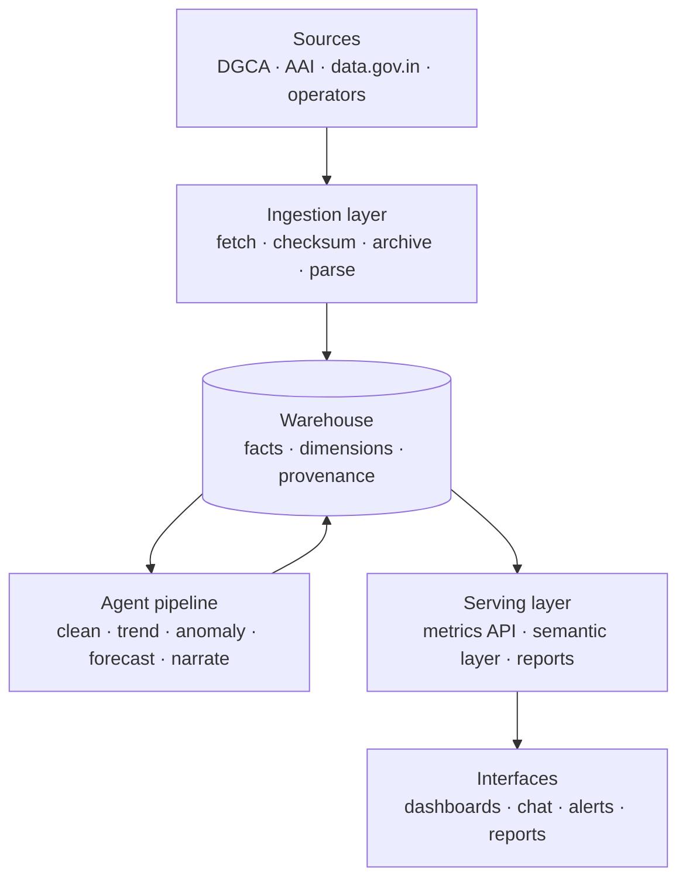

# Software Requirements Specification

**Project:** Air Cargo Intelligence
**Document version:** 2.0
**Status:** Approved for implementation

---

## Table of Contents

1. [Document Overview](#1-document-overview)
2. [Problem Definition](#2-problem-definition)
3. [Proposed Solution](#3-proposed-solution)
4. [System Architecture](#4-system-architecture)
5. [Agent Architecture](#5-agent-architecture)
6. [Functional Requirements](#6-functional-requirements)
7. [User Interfaces](#7-user-interfaces)
8. [Data Requirements](#8-data-requirements)
9. [Non-Functional Requirements](#9-non-functional-requirements)
10. [Stakeholders and Beneficiaries](#10-stakeholders-and-beneficiaries)
11. [Assumptions and Constraints](#11-assumptions-and-constraints)
12. [Risks and Mitigations](#12-risks-and-mitigations)
13. [Measurable Impact](#13-measurable-impact)
14. [Scalability](#14-scalability)

---

## 1. Document Overview

### 1.1 Purpose

This document specifies the requirements for the **Air Cargo Intelligence** platform: an analytics system that converts fragmented Indian air-cargo datasets into automated insights, anomaly alerts, forecasts, and decision-support analytics through a multi-agent architecture.

It is written to be implementable. Where the earlier proposal named platform capabilities, this revision names concrete components, data contracts, and acceptance criteria.

### 1.2 Scope

**In scope**
- Ingestion of public Indian air-cargo datasets from aviation and government sources
- Automated cleaning, reconciliation, and unification into a governed warehouse
- Statistical trend analysis, anomaly detection, and short-term forecasting
- Grounded natural-language querying with source citation
- Dashboards, an alert feed, and automatically generated periodic reports

**Out of scope for the initial release**
- Real-time flight-level or shipment-level tracking
- Non-public or commercially licensed datasets
- Global (non-India) sources, deferred to Phase 2
- Maritime and rail freight, deferred to Phase 3

### 1.3 Definitions

| Term | Meaning |
|---|---|
| **EXIM** | Export-Import trade data |
| **Fact grain** | The lowest level at which a measure is stored: airport × period × direction × commodity × airline |
| **Conformed dimension** | A dimension table shared across all facts, so metrics are comparable across sources |
| **Provenance** | The recorded chain from a stored number back to the source document it was parsed from |
| **Grounded answer** | A natural-language response in which every numeric claim resolves to a stored fact row |
| **Semantic layer** | A registry of approved metric definitions that natural-language queries compile against |

---

## 2. Problem Definition

### 2.1 Problem statement

Indian air-cargo data exists but the intelligence does not. Datasets are published across multiple aviation and government sources (the Directorate General of Civil Aviation (DGCA), the Airports Authority of India (AAI), the Open Government Data portal, and individual airport operators) but they are fragmented, inconsistent, and difficult to analyse collectively.

Analysts must manually gather, clean, reconcile, and analyse these datasets to answer questions about cargo performance, airport growth, commodity movement, and airline logistics trends.

The fundamental issue is **not a lack of cargo data but the absence of a system that unifies and analyses it automatically.**

### 2.2 Context and significance

Air cargo underpins global trade, pharmaceutical supply chains, electronics exports, e-commerce logistics, and perishable-goods transport. Stakeholders depend on cargo analytics for airport infrastructure planning, logistics route optimisation, trade policy decisions, and cargo hub investment.

Fragmented data systems prevent those stakeholders from obtaining a timely view of cargo performance and emerging trends.

### 2.3 Specific challenges

**C1 · Data fragmentation.** Sources differ in format (PDF, XLSX, CSV, REST), unit (kg, MT, unqualified tonnes), identifier scheme (IATA, ICAO, free-text city names), reporting period (calendar month vs. Indian fiscal year), and granularity.

**C2 · Manual compilation.** Analysts download, clean, reconcile, and combine reports by hand. The work is slow, repetitive, and error-prone, and it must be repeated every reporting cycle.

**C3 · No timely analytics.** Stakeholders cannot quickly answer which airports are growing, which commodities drive demand, or why cargo declined in a region.

**C4 · No automated intelligence.** No existing system detects cargo patterns, explains logistics trends, or projects near-term movement across these sources.

**C5 · Unverifiable insight.** Hand-assembled analysis loses the link between a number and the document it came from, so conclusions cannot be audited or corrected at source.

---

## 3. Proposed Solution

An analytics platform that automates the entire cargo intelligence pipeline and behaves as a digital cargo intelligence analyst.

### 3.1 Core capabilities

1. Multi-source cargo data ingestion with recorded provenance
2. Automated cleaning, unit normalisation, and reconciliation
3. Trend and anomaly detection across airport, airline, state, and commodity dimensions
4. Short-term forecasting with prediction intervals
5. Automatically generated insight narratives grounded in stored facts
6. Interactive analytics dashboards
7. Conversational querying with source citation

### 3.2 Governing design principle

**The language model never computes a number.**

All metrics are produced by SQL over a governed semantic layer; all statistical results are produced by dedicated models. The language model is confined to three jobs: classifying user intent, planning queries against registered metrics, and narrating result rows it is handed. Any claim it produces that cannot be resolved to a stored fact row is rejected before it reaches a user.

This is what makes source citation a guarantee rather than a presentation feature, and it is the requirement from which the provenance model in [§8](#8-data-requirements) follows.

---

## 4. System Architecture

Four layers, stacked bottom-up.

| Layer | Responsibility | Components |
|---|---|---|
| **Ingestion** | Treat every external source as unreliable. Fetch, checksum, archive, then parse. | Prefect flows, format-specific parsers, provenance recorder |
| **Warehouse** | Single source of truth. Star schema with provenance on every fact. | PostgreSQL 16, `pgvector`, Alembic migrations |
| **Agent pipeline** | Enrich the warehouse with trends, anomalies, forecasts, and narratives. | LangGraph DAG over six agents |
| **Serving** | One implementation of every metric, consumed by all interfaces. | FastAPI, semantic layer, report generator |

**Why the agent pipeline writes back into the warehouse.** Trends, anomalies, forecasts, and insights are stored as rows, not computed on request. This makes results reproducible, allows an insight to be cited later, and keeps the serving layer a thin read path.

---

## 5. Agent Architecture

Six agents run as a directed graph. Each records a run so any output can be reproduced or retracted.

| # | Agent | Responsibility |
|---|---|---|
| 1 | **Ingestion** | Discover and fetch source artefacts, checksum them, archive raw copies, record `source_document` rows |
| 2 | **Cleaning & Reconciliation** | Canonicalise airport and airline codes, normalise units to kilograms, align fiscal to calendar periods, deduplicate overlapping reports |
| 3 | **Trend Analysis** | Compute YoY, MoM, CAGR, market-share shift, and seasonal decomposition across all dimensions |
| 4 | **Anomaly Detection** | Flag unusual movements using STL residual z-scores (only where the series carries five complete seasonal cycles), a robust median/MAD z-score against a trailing window, the consensus of the two, and a structural detector for services starting and stopping, scored by severity |
| 5 | **Forecast** | Produce short-horizon forecasts with prediction intervals, validated by rolling-origin backtest |
| 6 | **Insight Narrative** | Write grounded explanations over supplied rows, with a citation for every claim |

Agent 6 has no database access and no arithmetic responsibility. It receives a structured payload and explains it.

---

## 6. Functional Requirements

### FR-1 · Data ingestion

| ID | Requirement | Acceptance criterion |
|---|---|---|
| FR-1.1 | Fetch datasets from DGCA, AAI, `data.gov.in`, and configured airport operators | A scheduled run retrieves all registered sources or records a typed failure per source |
| FR-1.2 | Extract tabular data from PDF, XLSX, and CSV | Golden fixtures parse to expected output in CI |
| FR-1.3 | Archive every raw artefact before parsing | Every `source_document` row has a retrievable raw object and a SHA-256 checksum |
| FR-1.4 | Record provenance for every ingested row | Every fact row carries a non-null `source_document_id` |
| FR-1.5 | Detect an already-ingested artefact | Re-running a completed source produces no duplicate facts |

### FR-2 · Cleaning and reconciliation

| ID | Requirement | Acceptance criterion |
|---|---|---|
| FR-2.1 | Canonicalise airport identifiers | ≥ 95% of rows resolve without manual mapping; the remainder are quarantined, never dropped |
| FR-2.2 | Normalise all tonnage to kilograms | No fact row is stored in a non-kilogram unit |
| FR-2.3 | Align fiscal-year reporting to calendar periods | Fiscal and calendar sources for the same airport and month reconcile |
| FR-2.4 | Deduplicate overlapping reports | Duplicates resolved by publisher precedence; superseded rows retained and marked |
| FR-2.5 | Gate loads with validation assertions | Negative tonnage, broken references, or implausible period changes block the load |

### FR-3 · Trend analysis

| ID | Requirement | Acceptance criterion |
|---|---|---|
| FR-3.1 | Compute YoY, MoM, and CAGR per series | Values match an independently calculated reference set |
| FR-3.2 | Compute market-share shift by airport, airline, and commodity | Shares within a period sum to 1.0 within floating-point tolerance |
| FR-3.3 | Decompose series into trend, seasonal, and residual components | Components stored per series and per period |

### FR-4 · Anomaly detection

| ID | Requirement | Acceptance criterion |
|---|---|---|
| FR-4.1 | Detect unusual cargo movements | Precision ≥ 0.70 at 80% recall on the labelled review set |
| FR-4.2 | Score anomalies by severity | Every anomaly carries a severity and the evidence rows behind it |
| FR-4.3 | Suppress known seasonality | Recurring seasonal peaks do not raise alerts |
| FR-4.4 | Cap alert volume | ≤ 5 false positives per month at production thresholds |

> Example alert: *Pharmaceutical cargo declined 12% month-over-month at Hyderabad, outside the seasonally adjusted band.*

### FR-5 · Root-cause narrative

| ID | Requirement | Acceptance criterion |
|---|---|---|
| FR-5.1 | Generate an explanation for each flagged anomaly | Every published insight carries at least one citation |
| FR-5.2 | Reject ungrounded claims | An insight whose claims do not resolve to supplied rows is not published |

### FR-6 · Forecasting

| ID | Requirement | Acceptance criterion |
|---|---|---|
| FR-6.1 | Forecast short-horizon cargo volume | MAPE ≤ 12% at a 3-month horizon, beating a seasonal-naive baseline |
| FR-6.2 | Publish prediction intervals | 80% intervals achieve 75-85% empirical coverage in backtest |
| FR-6.3 | Validate with time-based splits | No random splitting; rolling-origin backtest only |

### FR-7 · Conversational querying

| ID | Requirement | Acceptance criterion |
|---|---|---|
| FR-7.1 | Answer natural-language questions about cargo data | ≥ 90% accuracy on the fixed question bank |
| FR-7.2 | Compile questions to read-only SQL over allowlisted views | No generated statement can write, and none reaches a non-allowlisted table |
| FR-7.3 | Cite every numeric claim | Citation validity is 100%; a failure blocks the response |
| FR-7.4 | Decline unanswerable questions | Out-of-scope questions return an explicit refusal, never a guess |

### FR-8 · Reporting

| ID | Requirement | Acceptance criterion |
|---|---|---|
| FR-8.1 | Generate monthly and quarterly briefs on request | A report is produced with charts embedded and no manual step |
| FR-8.2 | Push anomaly alerts to an alert feed | New anomalies appear in the feed within one pipeline cycle |

---

## 7. User Interfaces

### 7.1 Dashboards

| Page | Content |
|---|---|
| Cargo Overview | National KPI cards, tonnage trend, direction split |
| Airport Intelligence | Airport rankings, growth leaders, state-level view |
| Commodity Trends | Commodity mix, share shift, commodity heatmap |
| Airline Performance | Airline cargo share and trend |
| Intelligence Reports | Generated briefs and their source documents |

### 7.2 Conversational analyst

A chat interface answering natural-language questions with prose, a chart, the underlying rows, and citations.

Representative queries:
- *Show the top 5 cargo airports by growth.*
- *Which commodities are driving air cargo expansion?*
- *Explain the decline in pharmaceutical exports.*
- *Predict cargo demand next quarter.*

### 7.3 Alert feed

A reverse-chronological feed of detected anomalies with severity, evidence, and root-cause narrative.

### 7.4 Automated reports

One-click monthly and quarterly briefs with charts embedded, generated from stored facts and insights.

---

## 8. Data Requirements

### 8.1 Sources

| Source | Format | Cadence | Grain |
|---|---|---|---|
| DGCA traffic statistics | PDF tables | Monthly | Airport × airline × freight tonnage |
| AAI cargo reports | PDF / XLSX | Monthly | Airport × international/domestic split |
| Open Government Data portal | CSV / REST | Irregular | Varies by dataset |
| Airport operator releases | HTML / PDF | Quarterly | Airport-specific, often commodity-level |

### 8.2 Warehouse model

Star schema at grain: **airport × period × direction × airline × measure**.

> **Commodity is out of scope, and this is a scope cut rather than an
> omission.** No public source we could reach publishes cargo split by
> commodity: DGCA and AAI report tonnage per airport, and the Open
> Government Data aviation catalogue reports it per airline. Commodity
> detail exists only in individual airport-operator releases, which would
> need a separate scraper per operator for partial coverage. Leaving an
> unbuildable requirement in a specification is worse than removing it,
> so the claim is withdrawn until such a source is identified.

Facts arrive at **two grains**, and each fact records which it is:

| Grain | Published by | Key |
|---|---|---|
| `AIRPORT` | AAI, Eurostat | airport × month × direction |
| `AIRLINE` | data.gov.in (DGCA) | airline × fiscal year |

The Open Government Data aviation catalogue is airline-level throughout:
141 of its cargo-bearing datasets have no airport column and name the
carrier only in the dataset title. Recording the grain keeps both usable
without forcing either into the other's shape.

| Table | Type | Purpose |
|---|---|---|
| `fact_cargo_movement` | Fact | Tonnage in kilograms, with a provenance reference |
| `dim_airport` | Dimension | IATA, ICAO, name, city, state, international flag |
| `dim_airline` | Dimension | Carrier identity and country |
| `dim_date` | Dimension | Calendar and Indian fiscal period attributes |
| `source_document` | Provenance | Publisher, URL, checksum, publication date, raw object path |
| `ingest_run` | Provenance | Run identity, status, and timing |
| `trend`, `anomaly`, `forecast`, `insight` | Derived | Agent outputs, each traceable to its inputs |

### 8.3 Data quality rules

- Tonnage is non-negative and stored in kilograms
- Every fact row has a resolvable `source_document_id`
- Unresolved airport names are quarantined, never silently dropped
- Superseded rows are marked, never deleted
- Period-over-period change outside a plausible band is flagged for review before load

---

## 9. Non-Functional Requirements

| ID | Category | Requirement |
|---|---|---|
| NFR-1 | Performance | Dashboard queries return in under 2 seconds at p95 |
| NFR-2 | Performance | Chat answers return in under 10 seconds at p95 |
| NFR-3 | Freshness | New data is reflected within 24 hours of source publication |
| NFR-4 | Reliability | A failed source does not block the pipeline for other sources |
| NFR-5 | Reproducibility | Any published number can be traced to a source document and an agent run |
| NFR-6 | Security | The query path executes under a read-only role restricted to allowlisted views |
| NFR-7 | Security | Secrets are supplied by environment only and never committed |
| NFR-7a | Security | Credentials are redacted from logs, the provenance ledger and agent traces. Query-string keys make a bare URL unsafe to record |
| NFR-8 | Observability | Agent-run duration, source freshness, and query latency are exported as metrics |
| NFR-9 | Maintainability | Every parser ships with a golden fixture test |
| NFR-10 | Portability | The full stack runs locally with PostgreSQL and a virtualenv, and needs no external API to function |

---

## 10. Stakeholders and Beneficiaries

| Stakeholder | Need served |
|---|---|
| **Aviation authorities** | Airport infrastructure planning and cargo capacity management |
| **Logistics companies** | Route intelligence and cargo demand forecasting |
| **Freight forwarders** | Evidence-backed logistics proposals with zero manual compilation |
| **Government policy makers** | Trade strategy and export planning |
| **Analysts** | Removal of repetitive reconciliation work |

---

## 11. Assumptions and Constraints

| # | Assumption | Basis | Impact if wrong |
|---|---|---|---|
| A1 | Public aviation datasets remain accessible | Government portals publish cargo statistics on a regular cadence | Ingestion coverage drops; archived raw artefacts preserve history already collected |
| A2 | Source inconsistencies are mechanically normalisable | Differences are in format, unit, and identifier rather than in meaning | Manual crosswalk maintenance increases |
| A3 | Monthly grain is sufficient for the stated questions | Published sources report monthly | Finer-grained questions cannot be answered without new sources |
| A4 | Historical depth supports seasonal modelling | At least three years of monthly history is available per major airport | Seasonal decomposition and SARIMA degrade; forecasts fall back to simpler baselines |
| A5 | The initial release uses a limited source set | Proof-of-concept scope | None, the architecture is source-pluggable by design |

**Constraints**

- Only public, freely redistributable datasets may be ingested
- Published figures must not be altered; corrections are modelled as superseding rows
- The system must run end to end without a paid external API

---

## 12. Risks and Mitigations

| Risk | Likelihood | Impact | Mitigation |
|---|---|---|---|
| Source PDF layout changes without notice | High | High | Golden-fixture parser tests fail loudly in CI; raw archive allows re-parse without re-fetch |
| Airport or commodity naming drifts between releases | High | Medium | Curated crosswalk plus a quarantine queue rather than silent dropping |
| Sparse history limits forecast quality | Medium | Medium | Seasonal-naive baseline always available; forecasts publish intervals so uncertainty is visible |
| Language model produces a plausible but ungrounded claim | Medium | High | Model is barred from arithmetic; citation validation rejects ungrounded output before display |
| Government endpoint downtime | Medium | Low | Per-source isolation and retry with backoff; one failure does not stall the pipeline |
| Anomaly alerts become noise and get ignored | Medium | High | Explicit false-positive budget of ≤ 5 per month as an acceptance criterion |

---

## 13. Measurable Impact

| Outcome | Measure | Target |
|---|---|---|
| Reduced analyst effort | Manual compilation hours per reporting cycle | 60-70% reduction |
| Faster insight generation | Time from source publication to available insight | ≤ 24 hours |
| Auditable analysis | Share of published numbers traceable to a source document | 100% |
| Improved logistics strategy | Growth airports, emerging commodities, and route opportunities surfaced without manual analysis | Delivered as standing dashboards |

---

## 14. Scalability

The architecture is source-pluggable and dimension-extensible: a new source is a new parser plus a registry entry, and a new analytical dimension is a new conformed dimension table.

| Phase | Scope | Sources |
|---|---|---|
| **Phase 1 · Now** | Indian air cargo | DGCA, AAI, `data.gov.in`, airport operators |
| **Phase 2 · Scale** | Global air cargo | IATA, Eurostat |
| **Phase 3 · Expand** | Multi-modal freight | Maritime and rail intelligence |

Additional agents can be added to the pipeline graph without redesigning the warehouse or the serving layer, because every agent's contract is the same: read defined rows, write defined rows, record the run.
